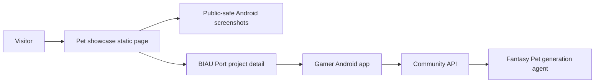

# Pet App Showcase Site

Static showcase and download-status page for the current Gamer Pet Android app surface. It presents the real emulator screenshots that are safe for visitors, while keeping the public APK download disabled until release gates are complete.


## Contents

- [Preview](#preview)
- [Why This Exists](#why-this-exists)
- [Features](#features)
- [Architecture](#architecture)
- [Quick Start](#quick-start)
- [Deployment](#deployment)
- [Assets](#assets)
- [Download Policy](#download-policy)
- [Testing](#testing)
- [Security](#security)
- [Roadmap](#roadmap)
- [Public Links](#public-links)

## Preview

Open `index.html` directly in a browser. No build step is required.

```powershell
cd pet-app-showcase-site
Start-Process .\index.html
```

The page keeps the product name as **Gamer Pet App** and shows the parent site brand as **BIAU Port / 泊岸** in the browser title, favicon, visible first screen, and bridge links.

## Why This Exists

The Pet workspace is still moving through a multi-repository app + community + generation pipeline. This static page gives visitors a truthful public-facing surface before the full APK release is approved:

- show the current Android app screens without requiring an install;
- explain the current product surface: desktop pet home, hatchery, community, profile;
- keep the APK button disabled until build, signing, checksum, release notes, regression, and human approval are ready;
- route deeper engineering context back to the main BIAU Port project page.

## Features

- Pure static HTML/CSS page with no JavaScript build pipeline.
- Real Android E2E screenshots copied into `assets/`.
- First-screen status board for app shape, core flow, download state, and release gate.
- APK release checklist rendered as visitor-facing content.
- Disabled download state with no placeholder APK URL.
- Public links back to BIAU Port and the source directory.

## Architecture



This directory owns only the static visitor page. The Android app, Community API, Admin Review prototype, and generation agent live elsewhere in the `gamer` / `fantasy-pet-rule` workspace boundary.

## Quick Start

```powershell
cd pet-app-showcase-site
Start-Process .\index.html
```

Optional local HTTP server:

```powershell
python -m http.server 4174
```

Then open `http://localhost:4174/`.

## Deployment

This directory is the source/reference version of the showcase page. The public BIAU Port entry is served from:

- `https://biau.playlab.eu.cc/pet-app-showcase/`

When syncing this page into the main site, keep it as a static HTML/CSS page and reuse only public-safe screenshots. Do not copy private artifact paths, server addresses, tokens, signing paths, local build output, or raw run logs into the public site.

Recommended static host settings:

| Field | Value |
| --- | --- |
| Framework preset | `None` |
| Build command | leave empty |
| Output directory | directory containing `index.html` |
| Environment variables | none required |

## Assets

The screenshots in `assets/` are copied from the current Android E2E artifacts:

- `android-main.png`
- `android-hatch.png`
- `android-community.png`
- `android-profile.png`

Keep these screenshots current and public-safe. Replace them only with images that show the actual app state and do not expose private tokens, internal hostnames, local file paths, raw generated artifacts, or user-sensitive data.

## Download Policy

The page intentionally does not publish or link an APK yet. Public APK download should be added only after all release gates are complete.

Before enabling the download button, prepare:

- reproducible public build command and version name/code;
- release signing policy;
- SHA-256 checksum;
- release notes with current limitations;
- basic regression evidence for home, hatchery, community, profile, and package gates;
- human approval that the APK can be public.

Do not replace the disabled download state with a placeholder link.

## Testing

Static checks:

```powershell
Test-Path .\index.html
Test-Path .\styles.css
Test-Path .\favicon.svg
Test-Path .\assets\android-main.png
Test-Path .\assets\android-hatch.png
Test-Path .\assets\android-community.png
Test-Path .\assets\android-profile.png
rg -n "sk-|DATABASE_URL|PRIVATE KEY|BEGIN RSA|BEGIN OPENSSH|file://" .
git diff --check
```

Manual browser checks:

- disabled APK button remains disabled;
- all four screenshots render;
- main project link opens the BIAU Port project detail page;
- source link points at the intended repository directory;
- mobile viewport keeps text and buttons inside their containers.

## Security

- Do not publish debug APKs as official releases.
- Do not expose internal generation worker routes, private tokens, local artifact paths, model/provider endpoints, signing files, or server addresses.
- Keep APK release approval separate from static page deployment.
- Keep `favicon.svg` aligned with the canonical BIAU Port / 泊岸 mark used by the main site and sibling project demos.

## Roadmap

- Add a versioned APK release block after public-release approval.
- Add checksum and release notes when the APK is enabled.
- Add an optional static `release.json` manifest for machine-readable APK metadata.
- Refresh screenshots after the next Android UI polish pass.
- Keep the page aligned with the BIAU Port `pet-workspace` project detail page.

## Public Links

- Public showcase page: `https://biau.playlab.eu.cc/pet-app-showcase/`
- Main project page: `https://biau.playlab.eu.cc/projects/pet-workspace`
- Showcase source directory: `https://github.com/Drew-Z/gamer/tree/cursor-windows-migration/pet-app-showcase-site`
