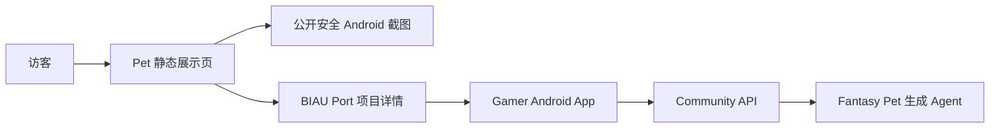

# Pet App 展示页

中文文档 | [English README](README.md)

这是当前 Gamer Pet Android 应用的静态展示与下载状态页。页面展示公开安全的真实模拟器截图，同时在正式 release gate 完成前保持 APK 下载禁用。

## 用途

Pet 工作区仍处于多仓库 app + community + generation pipeline 推进中。这个静态页用于在完整 APK 发布前提供可信的访客入口：

- 展示当前 Android App 界面，不要求访客安装；
- 说明当前产品表面：桌宠主页、孵化、社区、个人页；
- 在构建、签名、校验、发布说明、回归和人工审批完成前禁用 APK 下载按钮；
- 把深入工程上下文链接回 BIAU Port 项目页。

## 功能

- 纯静态 HTML/CSS，无 JavaScript 构建流程。
- 使用 `assets/` 中的真实 Android E2E 截图。
- 首屏状态板展示 app 形态、核心流程、下载状态和 release gate。
- 访客可读的 APK 发布清单。
- 禁用下载状态，不提供占位 APK URL。
- 链接回 BIAU Port 与源码目录。

## 架构



该目录只负责静态访客页面。Android App、Community API、Admin Review 原型和生成 Agent 位于 `gamer` / `fantasy-pet-rule` 工作区边界的其他位置。

## 快速开始

可以直接双击打开 `index.html`。也可以启动本地 HTTP 服务：

```bash
cd pet-app-showcase-site
python -m http.server 4174
```

然后打开：

```text
http://localhost:4174/
```

## 部署

公开 BIAU Port 入口：

```text
https://biau.playlab.eu.cc/pet-app-showcase/
```

同步到主站时，请保持它是静态 HTML/CSS 页面，只复用公开安全截图。不要把私有 artifact 路径、服务器地址、token、签名路径、本机构建输出或原始运行日志复制进公开站。

## APK 发布边界

页面目前不发布或链接 APK。只有完成以下事项后才能启用下载按钮：

- 可复现公开构建命令和版本号；
- release signing 策略；
- SHA-256 校验；
- 当前限制说明和 release notes；
- 主页、孵化、社区、个人页和 package gate 的基础回归证据；
- 人工批准 APK 可以公开。

## 检查

```bash
test -f index.html
test -f styles.css
test -f favicon.svg
test -f assets/android-main.png
test -f assets/android-hatch.png
test -f assets/android-community.png
test -f assets/android-profile.png
rg -n "sk-|DATABASE_URL|PRIVATE KEY|BEGIN RSA|BEGIN OPENSSH|file://" .
git diff --check
```

## 安全边界

- 不把 debug APK 包装成正式 release。
- 不暴露内部生成 worker route、私有 token、本地 artifact 路径、模型/provider endpoint、签名文件或服务器地址。
- APK 发布审批与静态页面部署分开管理。
- `favicon.svg` 应与 BIAU Port / 泊岸统一标识保持一致。

## 许可证

该静态页所在工作区尚未完成统一许可证决策。正式作为可复用开源项目推广前，需要选择并添加许可证。
